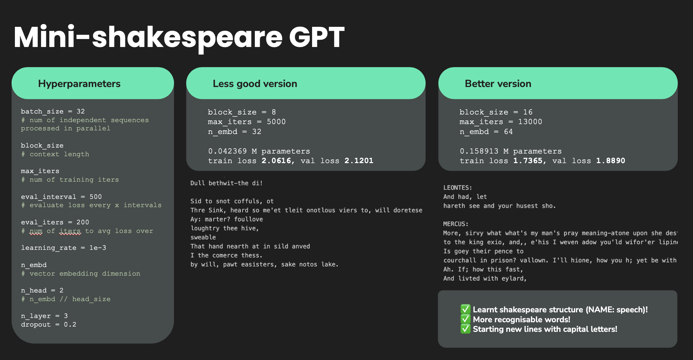

# GPT From Scratch

This repo documents my journey of building a **mini GPT** model from scratch in PyTorch! 
It starts with a simple **Names Generator** project to learn neural network fundamentals, then scales up to a full **GPT implementation** with attention and transformer blocks. 
Please see the slides for code walkthrough and conceptual explanations<3

---

## Projects

### 1. Names Generator (Learning MLP Basics)
Learn the foundations of Multilayer Perceptrons (MLPs) by generating realistic-looking names one character at a time

**Progression through 4 versions**:  
  1. **Bigram model** – frequency table of character pairs  
  2. **MLP** – single hidden layer predicting next character  
  3. **Embeddings + Normalization (BatchNorm, Kaiming init)** – improved input representation and stable training  
  4. **WaveNet-style model** – preserves temporal structure and captures longer dependencies  

Slides: [`Building Names Generator - MLP.pdf`](./slides/Building%20Names%20Generator%20-%20MLP.pdf)  

---

### 2. GPT From Scratch
Scale up from character-level MLPs to a transformer-based GPT language model trained on Shakespeare

**Components implemented**:
  - Data batching and autoregressive setup  
  - **Attention heads** with queries, keys, values  
  - **Multi-head attention** for richer context  
  - **Transformer blocks** (attention + feedforward + residual + layer norm)  
  - Positional embeddings to preserve order  
  - Dropout and residuals for stable training  
  - Training loop with AdamW optimizer  

**Results**:
  - Learnt Shakespeare-like structure (character names, dialogue format)  
  - Generated text with recognisable words and formatting



Slides: [`Building GPT.pdf`](./slides/Building%20GPT.pdf)  

---

## Repository Structure

```bash
gpt-from-scratch/
│
├── notebooks/
│ ├── names_generator_v1.ipynb
│ ├── names_generator_v2.ipynb
│ ├── names_generator_v3.ipynb
│ ├── names_generator_v4.ipynb
│ └── final_gpt.ipynb
│
├── slides/
│ ├── Building Names Generator - MLP.pdf
│ └── Building GPT.pdf
│
├── images/ # diagrams used in notebooks
├── data/ # texts used for training
├── requirements.txt
└── README.md
```

## Credits!!
Credits to Andrej Karpathy’s excellent lectures and makemore series. 
All code and notes here were built as a learning exercise to deepen understanding of modern language models.
